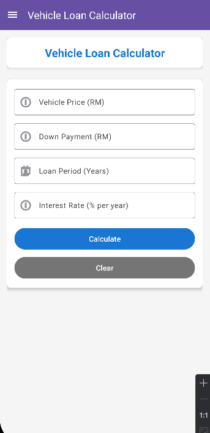
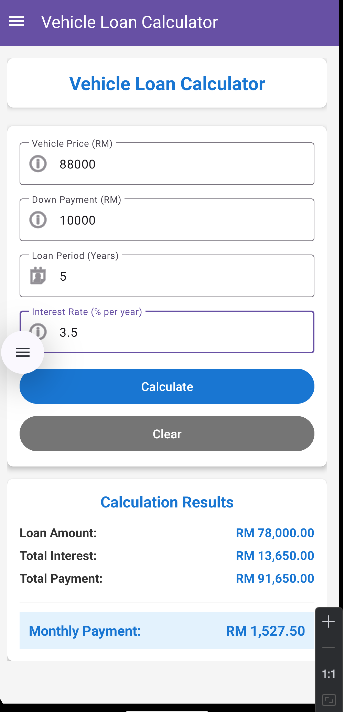
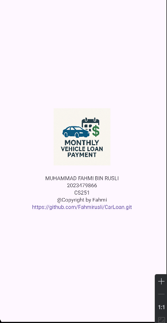

# Vehicle Loan Calculator 🚗💰

A mobile application for estimating monthly vehicle loan payments, developed as part of the ICT602 Mobile Technology course assignment.

# 📱 About The Project

This Android application helps users calculate their monthly vehicle loan payments based on vehicle price, down payment, loan period, and interest rate. The app provides a clean, user-friendly interface with accurate financial calculations.

# ✨ Features

- *Loan Calculator* : Calculate monthly payments with detailed breakdown
- *Input Validation* : Ensures all inputs are valid before calculation
- *Results Display* : Shows:
  - Loan Amount
  - Total Interest
  - Total Payment
  - Monthly Payment
- *Navigation Drawer* : Easy navigation between Home and About pages
- *About Page* : Author information and app details
- *Modern UI* : Material Design components for better user experience

# 📐 Calculation Formula

The application uses the following formulas as per assignment requirements:

1. *Loan Amount* = Vehicle Price - Down Payment
2. *Total Interest* = Loan Amount × (Interest Rate / 100) × Loan Period
3. *Total Payment* = Loan Amount + Total Interest
4. *Monthly Payment* = Total Payment ÷ (Loan Period × 12)

# Example Calculation

*Input :*
- Vehicle Price: RM 80,000
- Down Payment: RM 10,000
- Loan Period: 5 years
- Interest Rate: 3.5% per year

*Output :*
- Loan Amount: RM 70,000.00
- Total Interest: RM 12,250.00
- Total Payment: RM 82,250.00
- Monthly Payment: RM 1,370.83

# 🛠️ Built With

- *Android Studio* - IDE
- *Java* - Programming Language
- *Material Design Components* - UI Framework
- *AndroidX Libraries* - Support Libraries

# 📋 Prerequisites

- Android Studio Arctic Fox or later
- JDK 8 or higher
- Android SDK (API Level 24 or higher)
- Gradle 7.0+

# 🚀 Installation

1. Clone the repository
```bash
git clone https://github.com/yourusername/vehicle-loan-calculator.git
```

2. Open the project in Android Studio

3. Let Gradle sync and download dependencies

4. Update author information in `AboutFragment.java`:
```java
tvAuthorName.setText("Your Full Name");
tvMatricNo.setText("Your Matric Number");
tvGithubUrl.setText("Your GitHub URL");
```

5. Run the application on an emulator or physical device

## 👨‍💻 Author

- *MUHAMMAD FAHMI BIN RUSLI*
- Course: ICT602
- GitHub: [@Fahmirusli](https://github.com/Fahmirusli)

## 📄 License

© 2024 All Rights Reserved

This project is developed for educational purposes as part of the ICT602 course assignment.

 🙏 Acknowledgments

- ICT602 Mobile Technology Course
- Universiti Teknologi Mara (UiTM)
- Android Developer Documentation
- Material Design Guidelines

 📸 Screenshots

# Home Screen


# Calculation Results


# About Page


*📞 Contact*

For any queries regarding this project:
- Email: [2023479866@student.uitm.edu.my]
- GitHub Issues: [https://github.com/yourusername/vehicle-loan-calculator/issues](https://github.com/yourusername/vehicle-loan-calculator/issues)
